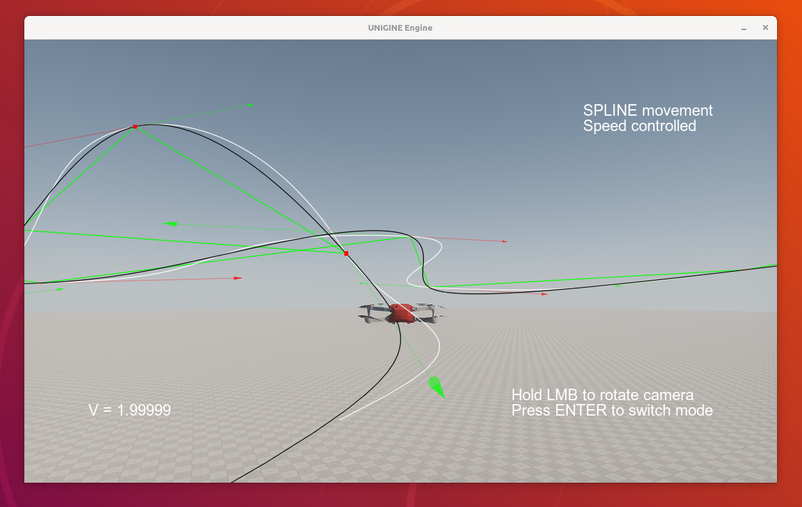

# Равномерное движение по параметрической кривой



Траектория определяется набором точек, заданном в файле `trajectory.json`. Файл содержит массив записей, где каждая запись соответствует точке траектории. Запись содержит следующие поля: `t`-параметр от 0 до 1, и `xyz`- координаты. 

Движение объекта осуществляется в следующих вариантах:
- ломанная линия - объект летит по прямой от одной точки до другой, параметр `t` не используется
- кривая Безье (встроенная в `UNIGINE` реализация), постоянная скорость не выдерживается
- [кубический сплайн](https://github.com/ttk592/spline) для каждой из координат: `x(t)`, `y(t)`, `z(t)`
- простой ручной режим `WSAD+LShift+Space`

Установка / запуск:
```
mkdir test && cd test
wget https://github.com/xelad0m/unigine.1st.try/releases/download/v0.0.2/bundle2.tar
tar -xvf bundle.tar .
./launch_release.sh
```

Проверялось:
- Alt Linux 
- UNIGINE SDK Community 2.16.1
- SDK Browser должен быть запущен 


# Телеметрия в приложении

В приложении можно подключиться к серверу телеметрии по консольной команде `login` (консоль в приложении открывается по кнопке `~`)
- по умолчанию без аргументов команда `login` пытается подключиться к серверу на `localhost:10227` с тестовым пользователем `test:dummy`
- можно вызвать команду с синтаксисом `login HOST PORT USERNAME PASSWORD`
- отключение от сервера по консольной команде `logout`

После авторизации на сервере приложение начинает передавать телеметрию с временной меткой каждого событий:
- координаты `x,y,z`
- вектор направления `x,y,z`
- нажатия клавиатуры
- нажатия и перемещения мыши

# Север телеметрии

Многопоточный сервер. Используются только встроенные библиотеки `python`.  
База данных сервера работает на `sqlite3` и включает две связанные таблицы: 
- `users` (хранение логинов и хешей паролей), 
- `sessions` (двоичные дампы сессий с временной меткой начала сессии)


Запуск сервера:
- убедиться, что установлен пакет `sqlite3`
```
sudo apt install sqlite3
```
- запустить сервер
```
python ./server/server.py -r
```
- остановка сервера `<Ctrl+C>`
- запуск сервера с параметром `-r` выведет информацию о количестве сохраненных сессий по каждому пользователю в БД
- после запуска в клиентском приложении в консоли можно запустить `login` и оно подключиться с тестовыми учетными данными

